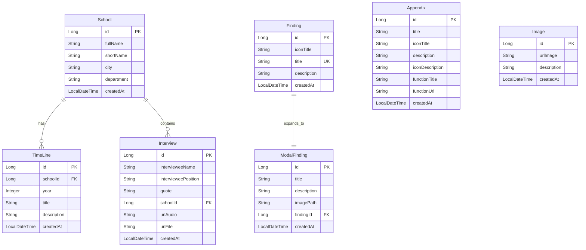

# Data Model Documentation

This document describes the data model for the Landing Backend application, which systematizes inclusive education experiences in Colombian schools. The model includes entity descriptions, field definitions, relationships, and an entity-relationship diagram.

## Model Descriptions

### 1. School
Represents an educational institution participating in the inclusive education systematization project.

**Fields:**
- `id`: Unique identifier for the school (Primary Key, BIGSERIAL)
- `fullName`: Full name of the educational institution (VARCHAR(255), NOT NULL)
- `shortName`: Short name or abbreviation of the institution (VARCHAR(500), nullable)
- `city`: City where the school is located (VARCHAR(100), nullable)
- `department`: Department/state where the school is located (VARCHAR(100), nullable)
- `createdAt`: Timestamp when the record was created (TIMESTAMP, default NOW())

**Validation Rules:**
- Full name is required
- Short name, city, and department are optional

**Relationships:**
- `timelines`: One-to-many relationship with TimeLine model (cascade delete)
- `interviews`: One-to-many relationship with Interview model

**Examples:**
- Institución Educativa Lorencita Villegas de Santos (Santa Rosa de Cabal, Risaralda)
- Institución Educativa Departamental Pio XII (Guataviata, Cundinamarca)

### 2. TimeLine
Represents a chronological entry documenting the evolution of inclusive education practices at a school.

**Fields:**
- `id`: Unique identifier for the timeline entry (Primary Key, BIGSERIAL)
- `school`: Reference to the School entity (Many-to-One, NOT NULL)
- `schoolId`: Foreign key referencing School (BIGINT, NOT NULL)
- `year`: Year of the timeline entry (INTEGER, NOT NULL)
- `title`: Title of the timeline entry (VARCHAR(255), NOT NULL)
- `description`: Detailed description of the events/practices (TEXT, nullable)
- `createdAt`: Timestamp when the record was created (TIMESTAMP, default NOW())

**Validation Rules:**
- School reference is required
- Year is required
- Title is required

**Relationships:**
- `school`: Many-to-one relationship with School model

**Examples:**
- Year 2018: "Ingreso e Identificación de Necesidades"
- Year 2021: "Creación del Comité de Inclusión y Ajustes Razonables"
- Year 2025: "Cierre de Investigación de Campo"

### 3. Finding
Represents a research finding or insight discovered during the systematization process.

**Fields:**
- `id`: Unique identifier for the finding (Primary Key, BIGSERIAL)
- `iconTitle`: Icon or emoji to display with the finding title (VARCHAR(255), nullable)
- `title`: Title of the finding (VARCHAR(255), NOT NULL, UNIQUE)
- `description`: Brief description of the finding (TEXT, nullable)
- `createdAt`: Timestamp when the record was created (TIMESTAMP, default NOW())

**Validation Rules:**
- Title is required and must be unique
- Icon title and description are optional

**Relationships:**
- `modalFinding`: One-to-one relationship with ModalFinding model

**Examples:**
- "Reconocimiento de la diferencia" (🌍)
- "Barreras identificadas" (🚧)
- "Prácticas exitosas" (🌱)
- "Retos pendientes" (🎯)

### 4. ModalFinding
Represents detailed information displayed in a modal dialog when a finding is clicked.

**Fields:**
- `id`: Unique identifier for the modal finding (Primary Key, BIGSERIAL)
- `title`: Title of the modal content (VARCHAR(255), NOT NULL)
- `description`: Detailed description/explanation of the finding (TEXT, nullable)
- `imagePath`: Path to the image displayed in the modal (VARCHAR(500), nullable)
- `finding`: Reference to the Finding entity (One-to-One, UNIQUE)
- `findingId`: Foreign key referencing Finding (BIGINT, UNIQUE)
- `createdAt`: Timestamp when the record was created (TIMESTAMP, default NOW())

**Validation Rules:**
- Title is required
- Finding reference must be unique (one modal per finding)
- Image path and description are optional

**Relationships:**
- `finding`: One-to-one relationship with Finding model

**Purpose:**
Provides expanded information, images, and detailed explanations for each finding displayed in the frontend modal dialogs.

### 5. Interview
Represents an interview conducted with a teacher as part of the research systematization.

**Fields:**
- `id`: Unique identifier for the interview (Primary Key, BIGSERIAL)
- `intervieweeName`: Name of the interviewed teacher (VARCHAR(255), NOT NULL)
- `intervieweePosition`: Position/role of the interviewee (VARCHAR(255), nullable)
- `quote`: Quote or key excerpt from the interview (TEXT, nullable)
- `school`: Reference to the School entity (Many-to-One, nullable)
- `schoolId`: Foreign key referencing School (BIGINT, nullable)
- `urlAudio`: URL to the audio recording of the interview (VARCHAR(500), nullable)
- `urlFile`: URL to the document/transcript of the interview (VARCHAR(500), nullable)
- `createdAt`: Timestamp when the record was created (TIMESTAMP, default NOW())

**Validation Rules:**
- Interviewee name is required
- School reference is optional (some interviews may be general)
- Position, quote, and URLs are optional

**Relationships:**
- `school`: Many-to-one relationship with School model

**Purpose:**
Stores teacher testimonies and quotes used in the carousel section of the frontend, with links to full audio recordings and transcripts.

### 6. Appendix
Represents supplementary research materials and documents available as appendices.

**Fields:**
- `id`: Unique identifier for the appendix (Primary Key, BIGSERIAL)
- `title`: Title of the appendix (VARCHAR(255), NOT NULL)
- `iconTitle`: Icon or emoji for the appendix (VARCHAR(255), nullable)
- `description`: Description of the appendix content (TEXT, nullable)
- `iconDescription`: Additional icon/emoji for description (VARCHAR(255), nullable)
- `functionTitle`: Title for the action/function button (VARCHAR(55), nullable)
- `functionUrl`: URL or function identifier for the action (VARCHAR(500), nullable)
  - Can be a URL (Google Drive, Google Docs link)
  - Can be the special value "GALLERY" to open the gallery modal
- `createdAt`: Timestamp when the record was created (TIMESTAMP, default NOW())

**Validation Rules:**
- Title is required
- Function URL can be a regular URL or "GALLERY" for special handling
- Other fields are optional

**Purpose:**
Provides links to research materials such as:
- Interview transcripts and matrices
- Categorical matrices
- Focus group records
- Document reviews
- Gallery of practices
- Audio recordings
- Final research document

### 7. Image
Represents an image in the gallery with its descriptive information.

**Fields:**
- `id`: Unique identifier for the image (Primary Key, BIGSERIAL)
- `urlImage`: Filename/path of the image in the gallery folder (VARCHAR(500), NOT NULL)
- `description`: Detailed description of the image content (TEXT, nullable)
- `createdAt`: Timestamp when the record was created (TIMESTAMP, default NOW())

**Validation Rules:**
- URL image is required
- Description is optional but recommended

**Relationships:**
- None (standalone entity)

**Purpose:**
Stores images displayed in the gallery carousel, including visual documentation of inclusive education practices, diagrams, and pedagogical materials.

**Examples:**
- `1.jpg` - "Soy un tesoro" message about student value
- `RAIZ ARBOL.jpg` - Tree diagram showing foundational values
- `BARRERAS - SOLUCIONES 2.jpg` - Diagram of barriers and solutions

## Entity Relationship Diagram



## Key Design Principles

1. **Referential Integrity**: All foreign key relationships ensure data consistency across the system.
   - School must exist before TimeLine or Interview entries
   - Finding must exist before ModalFinding

2. **Research Documentation**: The model is designed to systematically document educational research:
   - Chronological tracking of school progress (TimeLine)
   - Structured research findings (Finding/ModalFinding)
   - Teacher testimonies (Interview)
   - Supporting materials (Appendix, Image)

3. **One-to-One Relationships**: 
   - Finding ↔ ModalFinding: Each finding has exactly one detailed modal view

4. **Flexibility**: 
   - Schools can have multiple timeline entries across years
   - Multiple interviews can be associated with a school or be general
   - Appendices can link to external resources or trigger special UI functions

5. **Content Management**: 
   - Icons and emojis stored as text for flexible display
   - URLs stored for external resources (Google Drive, Google Docs)
   - Special function values (like "GALLERY") trigger frontend behaviors

## Database Schema Notes

- **Naming Convention**: Database columns use snake_case (e.g., `full_name`, `created_at`)
- **Java Entities**: Java fields use camelCase (e.g., `fullName`, `createdAt`)
- **Primary Keys**: All entities use `BIGSERIAL` (auto-increment) primary keys
- **Timestamps**: `created_at` fields use PostgreSQL `TIMESTAMP` with `DEFAULT NOW()`
- **Text Fields**: Long text content uses PostgreSQL `TEXT` type
- **Unique Constraints**: 
  - `Finding.title` is UNIQUE
  - `ModalFinding.findingId` is UNIQUE

## Migration History

The database schema is managed through Flyway migrations:

1. **V001__tables_base.sql**: Creates all base tables
2. **V002__school_seed.sql**: Seeds initial school data
3. **V003__timeline_seed.sql**: Seeds timeline entries for both schools
4. **V004__finding_seed.sql**: Seeds findings and their modal details
5. **V005__inverviewee_seed.sql**: Seeds interview/testimony data
6. **V006__appendix_seed.sql**: Seeds appendix/research material links
7. **V007__gallery_seed.sql**: Seeds gallery images with descriptions

## Usage Examples

### Query Timeline for a School
```java
// Spring Data JPA
List<TimeLine> timelines = timelineRepository.findBySchoolIdOrderByYearAsc(schoolId);
```

### Get Finding with Modal Details
```java
// Finding and ModalFinding are joined via one-to-one relationship
Finding finding = findingRepository.findById(findingId);
ModalFinding modal = finding.getModalFinding(); // Lazy-loaded
```

### List Interviews for a School
```java
List<Interview> interviews = interviewRepository.findBySchoolId(schoolId);
```

### Get All Appendices
```java
List<Appendix> appendices = appendixRepository.findAll();
// Frontend checks functionUrl == "GALLERY" to open gallery modal
```

### Get Gallery Images
```java
List<Image> images = imageRepository.findAll();
// Frontend displays in carousel with descriptions
```
